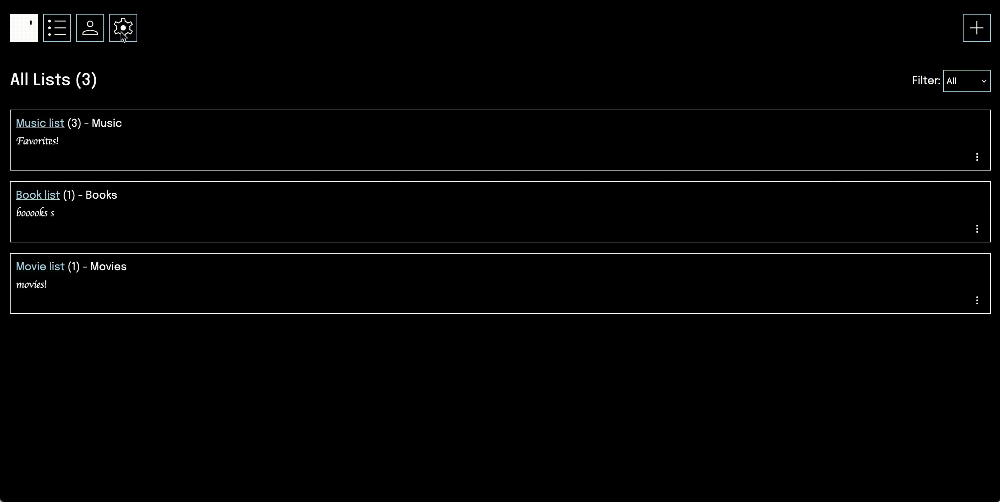

# Dejumbler
A tool to keep track of the media you consume (music, movies, books) all in one place.

Log in and out or press "demo" to try out temporarily with no account

Main page

Change themes!

## Tools Used
- Next.js for frontend and API routes
  - Recently migrated to Typescript
- MongoDB & Mongoose for database
- Next-Auth for authentication
- GSAP for animation
- Media data
  - Spotify API (music)
  - TMDB API (movies)
  - Open Library API (books)